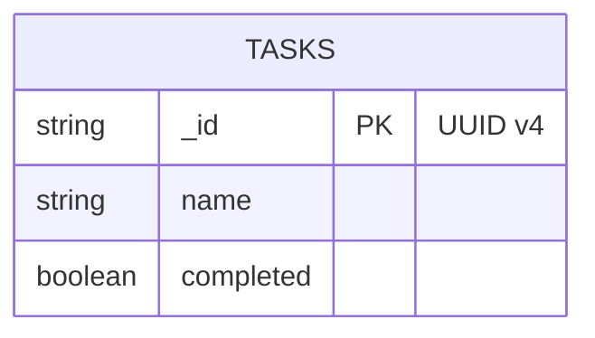

# EDD — Entity Document Diagram

MongoDB data model for the FARM Stack To-Do App.

## Database

| Setting       | Value        |
|---------------|--------------|
| Database name | `farm_intro` (set via `DB_NAME` env var) |
| Driver        | pymongo 4.x `AsyncMongoClient` |
| appName       | `farm-intro-api` |

---

## Collections

### `tasks`

Stores to-do tasks created by users.

#### Fields

| Field       | BSON type | Required | Notes                                     |
|-------------|-----------|----------|-------------------------------------------|
| `_id`       | String    | Yes      | UUID v4 string (not ObjectId)             |
| `name`      | String    | Yes      | Display label for the task                |
| `completed` | Boolean   | Yes      | `false` on creation; `true` when done     |

#### Example Document

```json
{
  "_id": "00010203-0405-0607-0809-0a0b0c0d0e0f",
  "name": "Buy groceries",
  "completed": false
}
```

#### Indexes

| Index      | Fields  | Type    | Notes                    |
|------------|---------|---------|--------------------------|
| `_id_`     | `_id`   | Default | Created automatically    |

No additional indexes are defined. Add an index on `completed` if you add filtering by status.

---

## ER Diagram



---

## Notes

- `_id` is a UUID string, not a MongoDB ObjectId. This is intentional so the frontend can use the ID directly without BSON serialisation.
- The `completed` field defaults to `false` in the Pydantic model; callers can omit it on creation.
- Deleting a task is a hard delete; there is no soft-delete or archive.
- The integration tests (`tests/test_integration.py`) create and drop a separate `farm_intro_integration_test` database and do not affect production data.
